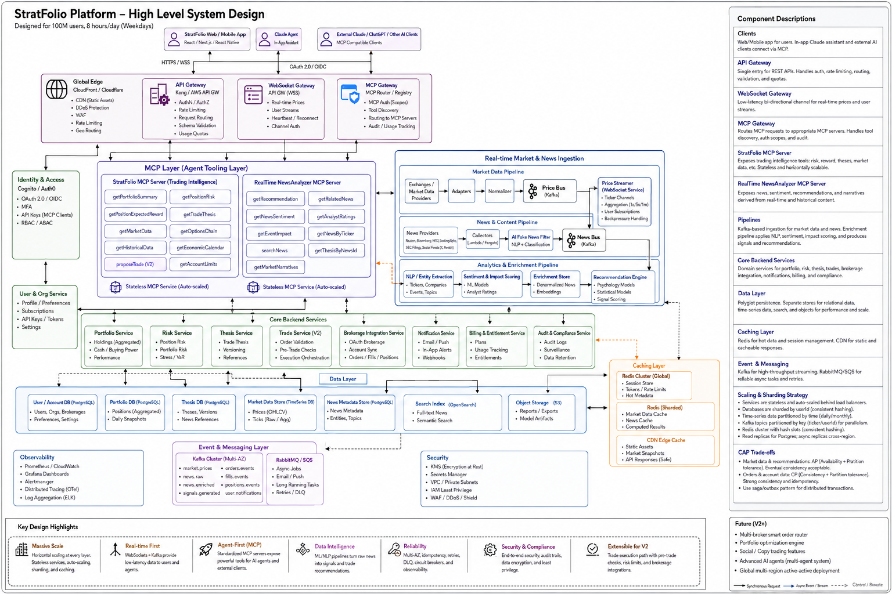
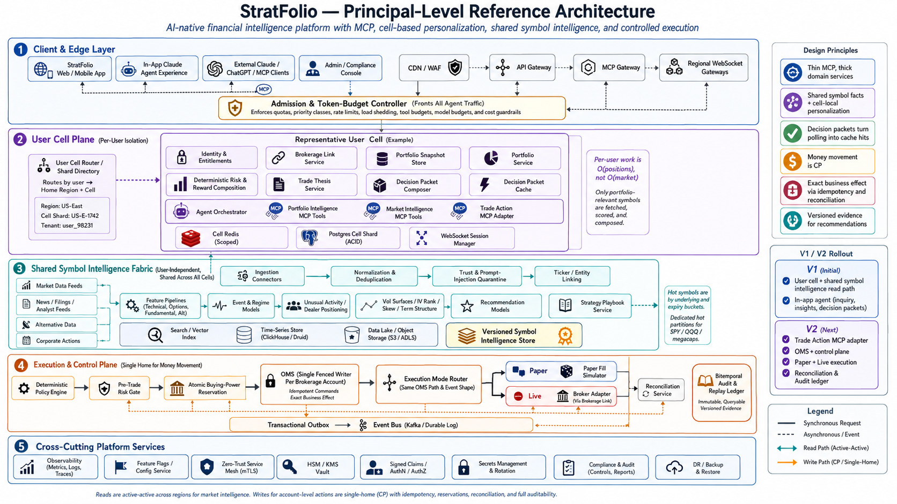

<div align="center">

# StratFolio

**AI financial intelligence platform that never sleeps.**

StratFolio analyzes your positions, prompts, market data, and news, to build plans for every trade. You judge the plans, or just let StratFolio work its magic. StratFolio continuously backtests every trade plan and your decisions to learn to better manage risk in your portfolio.

### Know what to buy. Know when to buy.
### Know StratFolio will get you out.\*

<sub>*\*AI auto-trade mode configurable at broker/plan/position level, paper trade mode available*</sub>


<sub>15-second walkthrough · every price, position and AI response is simulated</sub>

[**Install StratFolioUI →**](https://toniree.github.io/stratfolio-app/)

</div>

---

## AI-assisted autotrade rules, written in plain English

You don't build a condition tree. You write the rule the way you'd say it out loud, and it becomes a monitored plan attached to the position:

> *"Trim 50% when PLTR is around $195."*
>
> *"Close on Aug 20 at open if earnings missed."*
>
> *"Surprise beat? Sell 30% in the first hour; hold the rest until expiry."*
>
> *"Reassess risk if the option mark breaks below $4.84; keep max loss limited to premium."*

Each plan keeps the instruction you actually typed, carries an `open` or `close` intent, and can cap the capital it's ever allowed to deploy. Plans move `draft → watching → ready`, and the **Plans Executing Soon** view surfaces how close each one is to firing, so nothing triggers out of sight.

Plans come from two places — ones you write, and ones the AI drafts off a news catalyst — and every plan is labelled with which. **Only plans you created by hand or explicitly approved will execute automatically.** The intelligence proposes; the human authorizes.

> **Note:** Automatic execution is deliberately inert in this build. The rules, states, and readiness scoring are all real; nothing places an order.

### On the roadmap

Where plan rules go next, and the reason each one matters:

- **Plan backtesting viewer** — replay a rule against a contract's historical premium and show where it would have fired, what it would have filled at, and the resulting P/L. A rule you can't test is a guess with extra steps.
- **Paper trading mode** — an explicit paper balance and fill simulation, so a plan can run live against real prices with nothing at risk before it's ever trusted with capital.

## One book, every brokerage

Positions carry the brokerage they actually live in — **Robinhood · Schwab · Fidelity · E\*TRADE · Webull · Interactive Brokers** — so a book spread across six logins reads as one portfolio. Filter to a single brokerage or view them combined; concentration, day P/L and total return recompute against whatever is in scope.

## What else it is

Most portfolio UIs answer *"what do I own and what is it worth?"* StratFolio answers the question that actually precedes a trade: **"what is the thesis, what breaks it, and where do I get out?"**

The demo book is deliberately options-heavy — slightly-to-genuinely OTM contracts held through one or two earnings cycles, skewed toward semis, memory and AI infrastructure. Every position carries an AI conviction score, an entry and target band, explicit downside, a time horizon, and a written exit plan.

In the walkthrough above:

| | |
|---|---|
| **0–3s** | Live portfolio value, ticker strip, and a position card showing the contract's premium history against its entry line |
| **3–7s** | Swipe the positions carousel — each card carries conviction, notes, strike/expiry/qty, and its active plans |
| **7–13s** | Ask the assistant *"When should I sell my PLTRs?"* — it answers against your actual contract, catalyst, and rating |
| **13–15s** | Back to the book, with plans queued for execution |

## The AI layer is the point

Asked when to sell a real position in the book, the assistant doesn't return a generic answer:

> You hold 30 of the Jan 15 $95 calls at $6.20 — roughly 25% out of the money with the November 4 print and the February guide both inside the contract. The rating is HOLD, not SELL: US commercial customer count is compounding at 64% and that is the healthiest line in the P&L. The risk here is valuation, which is precisely why it is expressed as defined-risk premium rather than stock. Exit against the catalyst — trim into the November print rather than through it, because implied volatility is what you are being paid for.

Position-specific, catalyst-aware, and it argues *against* the question when the thesis says so.

## Running it

```bash
npm install
npm run dev          # → http://localhost:5173
```

```bash
npm run build        # typecheck + production build
npm test             # unit tests
npm run lint
```

No backend, no keys, no signup — the app boots straight into a populated demo book.

## How it's built

**React 19 · TypeScript · Vite · Tailwind v4 · TanStack Query · Zustand · Radix · Lightweight Charts**

Two decisions carry most of the architecture:

**A transport-agnostic API layer.** Components never import mock data. They call `portfolioApi`, `ideasApi`, `newsApi`, `plannerApi` and `assistantApi` through TanStack Query hooks; the `Mock*` implementations are swapped in at a single point in `src/api/index.ts`. Pointing this at the real Java/Python services is a one-file change, not a rewrite.

**One market-data simulator, not one timer per symbol.** `MarketDataSimulator` runs a single interval that batch-updates every symbol from a deterministic, seeded, mean-reverting path — which is both how a real WebSocket feed behaves and the reason the demo renders identically on every run instead of randomly tanking mid-presentation.

```
src/
  api/            interfaces + Mock* implementations + seeded options book
  components/
    portfolio/    hero metrics, performance chart, AI outlook panel
    positions/    holdings table, position cards, plans, trade tickets
    intelligence/ conviction, thesis, risk-reward — shared across surfaces
    ideas/ news/ planner/ charts/ shared/
  store/          market data, session, UI state
```

Desktop renders a dense dashboard; phones get a genuinely different carousel-first layout rather than a squeezed table.

### Regenerating the demo assets

The walkthrough is scripted, so it re-records deterministically after any UI change:

```bash
node scripts/record-demo.mjs     # drives a 390×844 Chromium, writes walkthrough.webm
node scripts/encode-demo.mjs     # → walkthrough.mp4 + a <4MB walkthrough.gif
node scripts/social-card.mjs     # → social-preview.png (1280×640)
```

## Platform context

This MVP is the client for a larger system design. The target architecture:

- **Java + Spring Boot** — orders, trade execution, portfolio services, risk controls, reconciliation, REST APIs
- **Go** — real-time market/news ingestion, WebSocket services, Kubernetes controllers
- **Python + PyTorch + QuantLib + scikit-learn** — options analytics, quant models, backtesting, recommendations
- **Claude + custom MCP servers** — agent tooling for portfolio intelligence, market analysis, trade theses, controlled trade actions
- **Platform** — PostgreSQL · Kafka · Redis · RabbitMQ/SQS · OpenSearch · WebSockets · Docker · Kubernetes · AWS/GCP
- **Concepts** — cell-based user isolation, shared market intelligence, thin MCP tooling, strongly consistent single-writer trades, transactional outbox





---

<div align="center">
<sub><b>Everything in this build is simulated.</b> Not investment advice, not connected to any brokerage, and no orders leave the browser.</sub>
</div>
